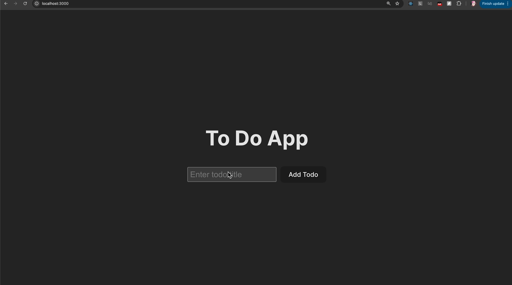

# Web Coding Challenge

- Completed the challenges!
- Added 2 unit tests (endpoint & TodoList component).
- Added some configs for testing.

## File Structure

#### Frontend

```
src
| 
|- components
    |- TodoItem.jsx
    |- TodoList.jsx
...
```

#### Backend

```
server
|
|- routes
|    |- api
|    |  |- hello (given)
|    |  |- todos
|    |      |- index.js (express routes logic)
|    |- index.js
|
|- services
|    |- dbHelpers
|         |- index.js (read/write helpers)
|    |- hello (given)
|
|- db.json (data from demo)
```

## Demo

<div align="center">
    
</div>

